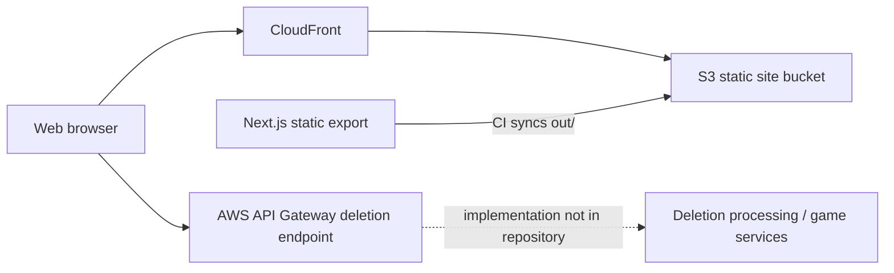
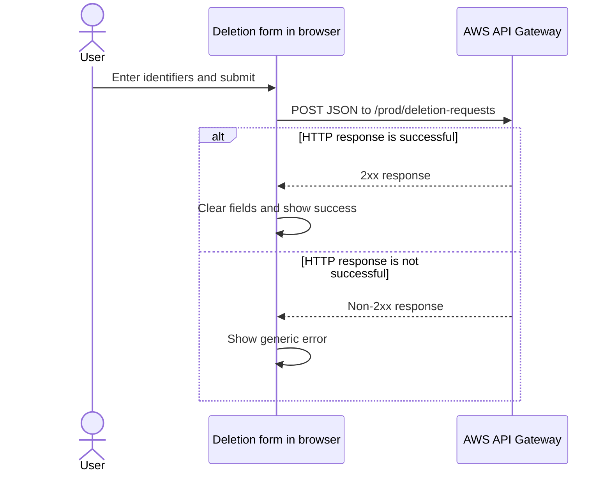

# Architecture

## Purpose and journeys

This repository contains the public companion website for CodeDragons' Raft Rush mobile game. It supports four user journeys:

1. Learn about Raft Rush and follow the Google Play installation link.
2. Read competition information and terms.
3. Read the game's privacy policy and links to relevant third-party policies.
4. Submit a request to delete game data using an email address, game user ID, and optional advertising ID.

## System boundary

The repository owns a Next.js frontend and its static build configuration. It does **not** contain the game, the deletion service implementation, infrastructure definitions, a database, authentication, or administration tools.

`next.config.mjs` sets `output: "export"`, so production consists entirely of static files. Features that require a Next.js server—API routes, server actions, request-time rendering, or middleware—are outside the current deployment boundary.

**Architectural assumption:** The workflow syncs the site to S3 and then invalidates a CloudFront distribution. It does not contain the CloudFront origin configuration, so the direct CloudFront-to-bucket relationship shown above is strongly implied but cannot be verified here. The handling of a deletion request after API Gateway accepts it is also not documented in this repository.

## Routes and rendering

| Route | Source | Responsibility | Rendering |
| --- | --- | --- | --- |
| `/` | `src/app/page.tsx` | Game landing page | Static Server Component |
| `/competition/` | `src/app/competition/page.tsx` | Competition details and terms | Static Server Component |
| `/privacy/` | `src/app/privacy/page.tsx` | Privacy policy | Static Server Component |
| `/privacy/delete-my-data/` | `src/app/privacy/delete-my-data/page.tsx` | Data-deletion form | Static page with hydrated Client Component |

`src/app/layout.tsx` provides the HTML shell, metadata, Inter font, navigation, and footer for every route. Page and component styles are colocated CSS Modules; `src/app/globals.css` contains the small global reset and shell layout.

App Router files are Server Components unless marked otherwise. The deletion page is the only `'use client'` component because it uses form events, `useState`, and browser-side `fetch`. No repository code runs on a server after deployment.

## Data flow and state

Most content is compiled into static HTML and has no runtime data source. The deletion form is the only data-fetching flow:

The component keeps form values and status in local React state. There is no shared state manager, caching layer, or server-side data fetching. Network exceptions are not currently caught, and the UI has no pending state or duplicate-submission guard.

## Authentication and authorisation

There is no site authentication or authorisation flow. All routes are public. The browser sends deletion requests without credentials in repository code. Any API-side validation, throttling, authentication, or authorisation is outside this repository and cannot be verified.

## External integrations

- **AWS API Gateway:** hard-coded browser endpoint for deletion requests.
- **AWS S3:** receives the `out/` static export during deployment.
- **AWS CloudFront:** invalidated after deployment.
- **Unity Ads and Unity Leaderboards:** described by the privacy pages as game data processors; there is no Unity SDK integration in this site.
- **Google Play:** external installation link.
- **Google Fonts:** Inter is configured through `next/font` and resolved during the Next.js build.
- **X/Twitter, Google support, and Unity policy pages:** outbound informational links.

## Deployment

A push to `main` triggers `.github/workflows/main.yml`:

1. Check out the repository.
2. Configure AWS credentials for `eu-west-2`.
3. install Node.js `20.11.1` and run `npm ci`.
4. Run `npm run build`, producing `out/`.
5. Synchronise `out/` to `s3://codedragons.co.uk` with deletion enabled.
6. Invalidate all paths in the configured CloudFront distribution.

The workflow references GitHub secrets `AWS_ACCESS_KEY_ID`, `AWS_SECRET_ACCESS_KEY`, and `CLOUDFRONT_DISTRIBUTION_ID`. Infrastructure provisioning, DNS, rollback, monitoring, and disaster recovery are not documented here.

## Architectural decisions visible in code

- Static export keeps the site deployable as files on S3; `trailingSlash` supports directory-style URLs and images are unoptimized for export compatibility.
- Interactivity is isolated to the deletion page; other routes remain static Server Components.
- Styling uses CSS Modules colocated with routes/components rather than a separate design system.
- The deletion API address is compiled into the public client bundle rather than supplied through environment configuration.

These are observations from the current implementation, not historical decision records.

## Known limitations

- No automated tests, test runner, observability, analytics, or application-level error reporting are present.
- CI builds and deploys but has no separate lint, type-check, or test steps.
- The deletion service contract and downstream processing are undocumented and cannot be validated locally without contacting production.
- The deletion form provides limited network-error handling.
- Competition and copyright content is dated 2024.
- Known markup/style issues are listed in [AGENTS.md](AGENTS.md#known-quirks).
