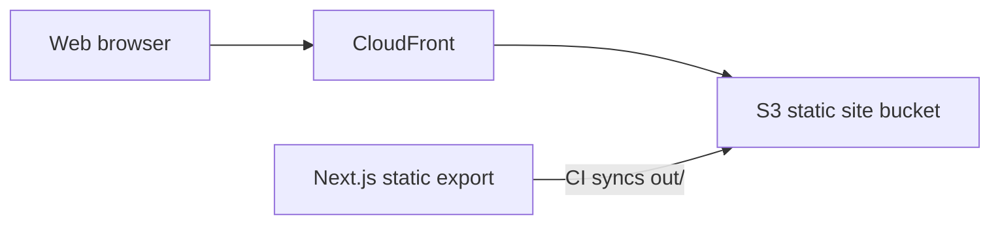

# Architecture

## Purpose

This repository contains the public marketing website for Numberfall. It explains the core arithmetic-path gameplay, promotes confirmed game features, describes the offline Daily Challenge and accessibility options, and presents an honest pre-launch Google Play status.

Approved product and visual claims live in [docs/numberfall](docs/numberfall/README.md). Missing store, support, privacy, and platform URLs must remain absent rather than being guessed.

## System boundary

The repository owns a Next.js frontend and its static build configuration. It does not contain the Numberfall game, a backend, database, authentication, analytics, payments, or infrastructure definitions.

`next.config.mjs` uses `output: "export"`, so production consists entirely of static files. API routes, server actions, middleware, and request-time rendering are outside the current deployment boundary.

**Architectural assumption:** The workflow syncs files to S3 and invalidates a CloudFront distribution, but the CloudFront origin configuration is not present here. The connection shown above is strongly implied rather than directly verifiable.

## Routes and rendering

| Route | Source | Responsibility | Rendering |
| --- | --- | --- | --- |
| `/` | `src/app/page.tsx` | Single-page Numberfall marketing experience | Static Server Component |

`src/app/layout.tsx` provides metadata, skip navigation, the shared header, and footer. The homepage uses semantic sections and CSS-only game motifs. Components remain Server Components; there is currently no client-side state, runtime data fetching, loading state, or empty state.

There is no authentication or authorisation flow. The site is public and does not collect user input. It has no runtime environment-variable references or external service calls.

## Deployment

A push to `main` triggers `.github/workflows/main.yml`:

1. Check out the repository.
2. Configure AWS credentials in `eu-west-2`.
3. Install Node.js `20.11.1` and dependencies with `npm ci`.
4. Build the static export into `out/`.
5. Synchronise `out/` to `s3://codedragons.co.uk`.
6. Invalidate the configured CloudFront distribution.

Deployment uses the GitHub secrets `AWS_ACCESS_KEY_ID`, `AWS_SECRET_ACCESS_KEY`, and `CLOUDFRONT_DISTRIBUTION_ID`. Infrastructure provisioning, DNS, rollback, monitoring, and disaster recovery are not documented in this repository.

## Decisions visible in code

- Static export keeps the site deployable as files on S3.
- The initial release is one focused marketing route with anchored sections.
- The unavailable store URL is represented by non-interactive “Coming soon” text.
- Visuals use CSS and semantic HTML because the marketing assets referenced by the Numberfall handoff are not present in this repository.
- The site uses a system font stack and has no trackers, cookies, accounts, forms, or third-party embeds.

These are observations from the implementation, not historical decision records.

## Known limitations

- Real gameplay screenshots and store artwork are unavailable in this repository, so the current site cannot provide photographic gameplay proof.
- Final store, support, privacy, and canonical URLs have not been supplied.
- There are no automated tests, analytics, or application-level error reporting.
- CI does not have separate lint, type-check, or test steps.
